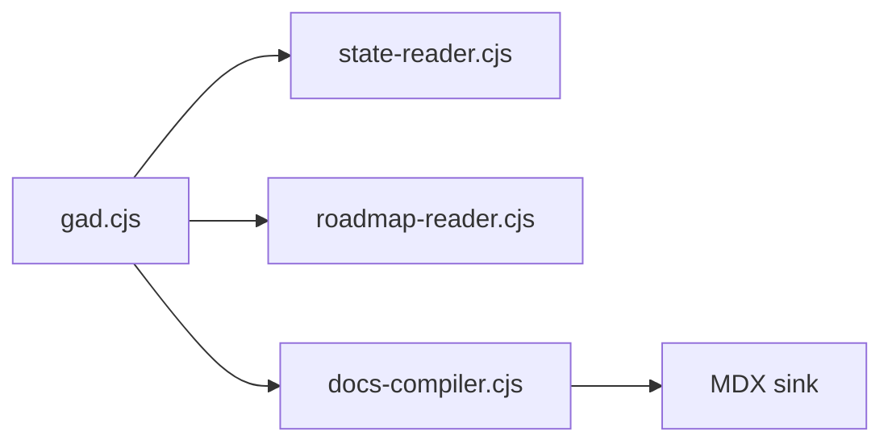

# gad:write-tech-doc

Writes a technical documentation MDX file into the sink covering architecture, data flow, or system design.

## When to use

- A system exists but its design hasn't been written down
- Onboarding a new agent or developer to a subsystem
- After a significant architectural decision — capture the "how" (decisions capture the "why")
- Before a major refactor — document current state first

## Step 1 — Identify what to document

```sh
gad decisions --projectid <id>   # find relevant decisions
gad docs list --projectid <id>   # see existing docs — don't duplicate
```

Scope the doc to one system or subsystem. "GAD CLI architecture" is good. "Everything about GAD" is too broad — split into multiple docs.

## Step 2 — Read the code

Actually read the implementation. Tech docs that describe what someone imagined the code does (instead of what it actually does) are worse than no docs. Key things to capture:

- Entry points (main files, CLI commands, API routes)
- Data flow (what calls what, what format data takes at each stage)
- Key abstractions (the 3-5 concepts someone needs to understand)
- External dependencies (what it talks to, what it assumes exists)

## Step 3 — Write the doc

**Path:** `apps/portfolio/content/docs/{project-id}/{system-name}.mdx` or `{project-id}/architecture.mdx`

**Frontmatter:**
```yaml
---
title: System Name — Technical Design
description: One-line description
---
```

**Structure:**
1. **Overview** — what this system does, 2-3 sentences
2. **Architecture** — high-level component diagram (mermaid if it helps)
3. **Data flow** — what happens when X triggers Y, step by step
4. **Key interfaces** — the functions/types/protocols that matter
5. **Constraints** — what it can't do, what it assumes, reference decision IDs
6. **File map** — which files own which responsibilities

### Mermaid diagrams

Use sparingly — only when the visual clarifies something text can't:



Keep diagrams in the doc, not separate files. If a diagram needs more than 15 nodes, the system is complex enough to split into multiple docs.

## Step 4 — Register in DOCS-MAP.xml

```xml
<doc kind="technical" sink="{project-id}/{system-name}.mdx" skill="gad:write-tech-doc">
  <description>What system this documents — one line</description>
</doc>
```

## Step 5 — Sync and verify

```sh
gad sink sync
gad docs list --projectid <id>
```

## What makes a good tech doc

| Quality | Check |
|---------|-------|
| Code-verified | Every claim matches the actual implementation |
| Decision-linked | References decision IDs for constraints and choices |
| Entry-point clear | A reader knows which file to open first |
| Not a tutorial | Explains the system, not how to rebuild it step by step |
| Bounded | Covers one system, not the entire project |

## What to avoid

- Describing planned architecture that doesn't exist yet — document what IS, not what will be
- Listing every function — focus on the 5-10 that matter for understanding
- Copy-pasting code — reference file:line, don't inline 50 lines of source
- Stale diagrams — if the code changed, update the diagram or delete it
