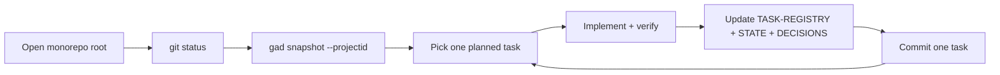

# Daily driver routine

What the operator does every time they sit down at the `custom_portfolio`
monorepo root. This is the meatspace counterpart to the canonical GAD agent
loop in decision **gad-18**, and it is what keeps the planning docs honest
across sessions.

The first action is always the same: open the repo at its root (not inside
a vendored project), eyeball `git status` for drift carried over from the
previous session, then run `gad snapshot --projectid <id>` for whichever
project is the day's focus. The snapshot is the single hydration point —
never re-read planning files by hand, never guess state from memory.
If the day is "framework work on GAD itself," the project id is
`get-anything-done`; if it is "tracking monorepo-level chores" it is
`global`; anything else, ask.

Once state is loaded, the operator picks exactly one planned task from
the snapshot's task registry, reads the task goal, and begins implementing
it in the normal Claude Code loop. Mid-task, no restarts and no context
re-hydrations happen unilaterally — per gad-17, restart suggestions are
allowed but only at clean planning boundaries.

When the implementation is done and verified (build + typecheck + any
verify command the task specifies), the operator updates three files in
lockstep: `TASK-REGISTRY.xml` (mark the task done with `skill`, `agent`,
and `type` attributes per gad-18), `STATE.xml` (set the `next-action` so
the next snapshot is self-describing), and `DECISIONS.xml` if any new
decisions were captured. Only then is a commit made — one task per commit
where possible — and the loop repeats.

The cadence is deliberately boring. The whole point of the GAD framework
is that the operator does not need a novel procedure each morning; the
snapshot tells them where they are and the loop tells them what to do next.

