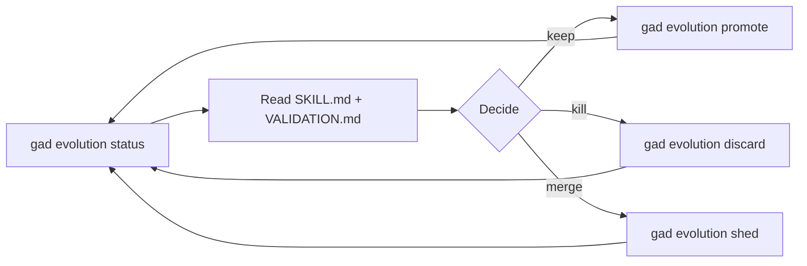

# Evolution review gate

The periodic human-in-the-loop review of proto-skills drafted by the
`create-proto-skill` pipeline. Proto-skills are a permanent skill type
(decision gad-167), but before they earn a canonical home in the framework
they need a human to rubber-stamp, reshape, or reject them.

The operator runs `gad evolution status` to see which proto-skills are
awaiting review. For each one, they open the proto-skill's SKILL.md plus
the companion VALIDATION.md that the pipeline produced and read both end
to end. The decision for each candidate is one of three: **promote** it
to a canonical skill (`gad evolution promote <slug>`), **discard** it as
not carrying its own weight (`gad evolution discard <slug>`), or **shed**
it — meaning the idea is good but belongs somewhere else, usually merged
into an existing skill (`gad evolution shed <slug>`).

The review is intentionally gated: the trace pipeline will happily mint
proto-skills all week, but the operator owns the decision about what
becomes part of the canonical surface. Always finish a review batch by
re-running `gad evolution status` to confirm the queue is empty (or that
any remaining items are consciously deferred).

