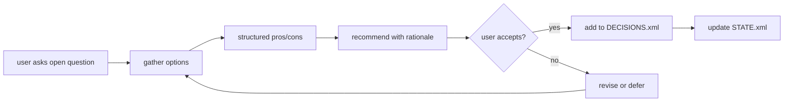

# GAD Workflows

Workflows are a first-class planning artifact. Each workflow describes an
**expected** sequence of skills, agents, CLI calls, and planning-doc updates
for a recurring kind of work (the main loop, a decision, an evolution pass,
a debug session, etc.).

At runtime the trace pipeline computes an **actual** graph from `.gad-log/`
events (skill invocations, agent spawns, tool calls, CLI commands, planning
file edits). The diff between expected and actual is rendered on the
`/planning` Workflows tab and emitted as a `workflow_conformance` score that
upgrades the flat `framework_compliance` metric (decision gad-173).

No enforcement. Advisory signal only. Drift is a tuning input, not a fault.

## File layout

```
.planning/workflows/
  README.md                         # this file
  <slug>.md                         # one workflow per file
```

Slugs are kebab-case, prefixed by origin: `gad-loop.md`, `gad-decide.md`,
`gad-evolution.md`, etc. Slugs MUST be unique across the project.

## File format

Each workflow file has YAML frontmatter followed by a body. The body may
contain explanatory prose and MUST contain exactly one mermaid fenced block.

```markdown
---
slug: gad-decide
name: GAD Decide
description: Structured decision pattern — open question → options → pros/cons → recommendation → commit.
trigger: User asks an open question with multiple viable answers.
participants:
  skills: []
  agents: [default]
  cli: [gad decisions]
  artifacts: [.planning/DECISIONS.xml]
parent-workflow: gad-discuss-plan-execute
related-phases: [42.3]
---

Short explanatory prose about why this workflow exists and how to read
the graph.


```

### Frontmatter fields

| Field | Required | Meaning |
|---|---|---|
| `slug` | ✓ | Kebab-case unique identifier |
| `name` | ✓ | Human-readable title |
| `description` | ✓ | One-paragraph summary |
| `trigger` | ✓ | Plain-english description of when this workflow starts |
| `participants.skills` | ✓ | Skills expected to appear in the actual graph (may be empty) |
| `participants.agents` | ✓ | Agents expected to appear (at minimum `default`) |
| `participants.cli` | ✓ | CLI commands expected (`gad *`, `npx *`, etc.) |
| `participants.artifacts` | ✓ | Planning files expected to be edited |
| `parent-workflow` | optional | Slug of a parent workflow — workflow nests as a subgraph inside the parent on /planning |
| `related-phases` | optional | Phase IDs this workflow is especially relevant to |

## Nesting (decision gad-173 answer (a))

Workflows can nest. A child declares `parent-workflow: <slug>` in its
frontmatter. On `/planning` the child renders as a mermaid subgraph inside
the parent's diagram. Current nesting plan:

```
gad-loop
├── gad-discuss-plan-execute
│   ├── gad-decide
│   └── gad-plan-phase
├── gad-debug
├── gad-evolution
└── gad-findings
```

A workflow may nest at most one level deep in its file declaration, but the
rendering pipeline flattens the tree, so deeper logical hierarchies are
expressed by chaining `parent-workflow` fields across multiple files.

## Validation (decision gad-173 answer (b))

There is no separate validator schema. The validator IS the expected/actual
diff, computed by the trace-analysis pipeline:

```
workflow_conformance =
  (matching_nodes − extra_nodes − out_of_order_nodes) / expected_nodes
```

Matching nodes: actual node matches an expected node by participant identity
(same skill / agent / cli command / artifact path) AND position in the
topological order of the expected graph.

Extra nodes: actual nodes with no expected counterpart.

Out-of-order nodes: actual nodes that match an expected node but ran
before/after their expected topological predecessors/successors.

Score is advisory. Negative scores clamp to zero. When every run deviates
the same way, the expected graph is wrong. When one run deviates, that
run is worth investigating.

## Trace self-report (decision gad-173 answer (c))

GAD-aware skills and agents emit explicit workflow events into
`.trace-events.jsonl`:

```jsonl
{"ts": "...", "event": "workflow_enter", "slug": "gad-decide", "instance_id": "..."}
{"ts": "...", "event": "workflow_exit",  "slug": "gad-decide", "instance_id": "...", "status": "complete"}
```

The synthesizer prefers these explicit markers when available and falls
back to sequence inference (matching observed tool/skill/agent patterns
against expected graphs) when they are missing. Legacy runs and non-GAD
skills always go through inference.

## Authoring rules

1. **Start from the actual pattern you observe.** Don't design a workflow
   you've never seen. Author `gad-decide` because we just did a decide.
2. **Keep the graph small.** ~8-12 nodes per workflow max. Nest to break
   up bigger flows.
3. **Use decision diamonds sparingly.** One or two per workflow. More than
   that and the graph is describing two workflows.
4. **Name nodes as verbs.** `gather options` not `options gathered`.
5. **Participants are a contract.** Only list skills/agents/cli commands
   that MUST appear. Optional participants belong in prose.
6. **Related phases let the workflows tab link back.** A workflow tied to a
   phase should list the phase ID so readers can jump to its plan.
