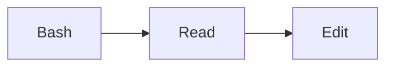

# Emergent workflows (proto-workflows)

This directory holds **proto-workflows** — workflow candidates drafted by
the trace-mining detector (decision gad-174) from recurring patterns in
`.planning/.trace-events.jsonl`. They are the workflow analog of
`.planning/proto-skills/` (decision gad-167).

## Lifecycle

```
recurring trace pattern
  → emergent-workflow candidate (detector output)
  → proto-workflow (.planning/workflows/emergent/<slug>.md)
  → promoted authored workflow (.planning/workflows/<slug>.md)
```

A proto-workflow file follows the same schema as authored workflows in
`.planning/workflows/README.md` with three added frontmatter fields:

```yaml
---
slug: emergent-bash-read-edit-12
name: "Emergent: Bash → Read → Edit"
description: Recurring tool-use sequence detected 12× in trace data.
trigger: Detected automatically from .planning/.trace-events.jsonl.
participants:
  skills: []
  agents: [default]
  cli: []
  artifacts: []
parent-workflow: null
related-phases: [42.3]
origin: emergent               # <-- marks this as a proto-workflow
support:                        # <-- detector output
  phases: 12                    #     number of instances observed
  stability: 1.0                #     edge-stability across instances (0..1)
evidence:                       # <-- optional list of trace_instance_ids
  - "seq-1234..1250"
---


```

## Generation

v1 proto-workflows are generated in-memory during `build-site-data.mjs`
from the `detectEmergentWorkflows()` function and emitted directly into
`catalog.generated.ts` as entries with `origin: "emergent"`. They do NOT
persist to disk until the human promotes them.

This is deliberate: the detector runs every build and regenerates
candidates from the latest trace data. Persisting every run would create
churn. Only promotion (via `gad workflow promote <slug>`) writes a file.

## Promotion

When a human decides a proto-workflow is worth keeping:

```sh
gad workflow promote <slug> [--name <name>]
```

This:
1. Reads the emergent entry from the latest `catalog.generated.ts`.
2. Writes `.planning/workflows/<final-slug>.md` with the detector's
   mermaid body, `origin: authored`, and a `PROVENANCE.md` section
   recording the original emergent slug, support count, and detection
   date (so the workflow remembers it was born from the detector — same
   pattern as proto-skill promotion).
3. The next build picks it up as an authored workflow.

## Discard

```sh
gad workflow discard <slug>
```

Removes the candidate from the current run. The detector will re-emit
it on the next build if the pattern still meets thresholds — that is
a feature, not a bug. To permanently suppress a pattern, raise the
detector thresholds in `.planning/config.json`.

## Thresholds (v1)

Configured in decision gad-174, tunable in `.planning/config.json`:

| Threshold | Default | Meaning |
|---|---|---|
| `min_support` | 3 | Minimum occurrences in the trace to be a candidate |
| `min_length` | 3 | Minimum sequence length (2-node sequences are just edges) |
| `max_length` | 5 | Maximum sequence length the detector mines for |
| `max_emergent` | 12 | Max candidates surfaced per build (top by score) |

Score is computed as `length × support` so longer recurring patterns
rank above shorter ones with similar support.
