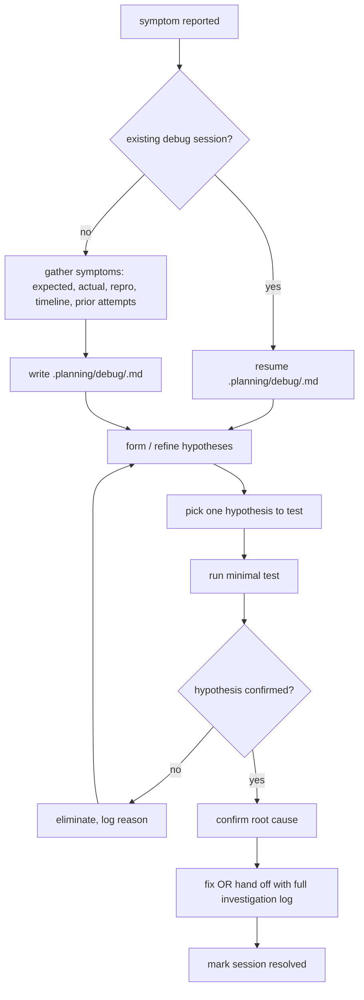

The GAD debug loop turns debugging into a persisted, resumable
investigation. A `.planning/debug/<slug>.md` file captures symptoms,
hypotheses, investigation log, and root cause as the agent works. If
the session compacts or crashes mid-investigation, the file is
enough to rehydrate the state and continue — no lost hypotheses,
no re-discovered dead ends.

The value of the workflow is the disciplined hypothesis step. Without
it the agent will guess at random fixes. With it, the agent is forced
to name the thing it's testing before testing it, which both speeds up
elimination and makes the investigation log useful to a human later.

