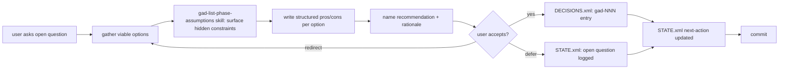

This is the pattern the user explicitly validated on 2026-04-14 when they
said "I like this so much I want this to be in our workflow." The agent
gathers candidate approaches, lays out pros and cons for each, names a
recommendation with reasoning, and waits for the user to accept, redirect,
or defer. Accepted recommendations become `<decision>` entries in
DECISIONS.xml with an id, title, summary, and impact. STATE.xml's
`next-action` is updated if the decision changes the queue.

Do NOT skip the pros/cons step. The value of the workflow is the
structured comparison, not the recommendation itself. A recommendation
without explicit tradeoffs is just an opinion, and the user loses the
ability to pressure-test it.

