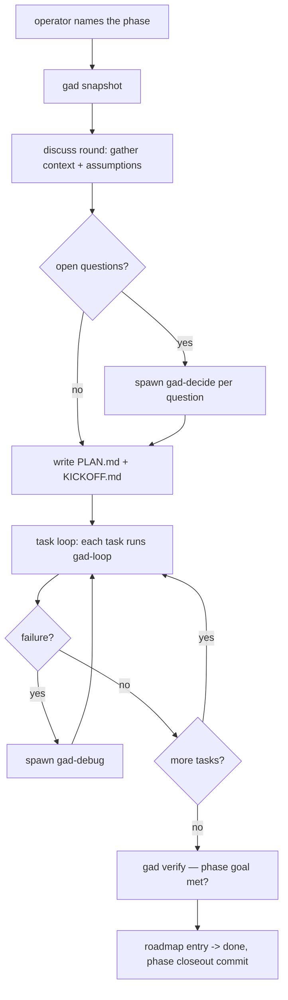

The phase-level workflow that wraps the per-task `gad-loop`. Discuss
gathers the context and decisions needed to plan; plan writes the
task list to PLAN.md; execute runs the tasks one at a time through
`gad-loop` until the phase's definition-of-done is met. Each sub-round
is allowed to spawn `gad-decide` (for any open question) or `gad-debug`
(for any unexpected failure). The phase closes when `gad verify`
confirms the deliverables exist and the roadmap entry flips to `done`.

Do NOT skip discuss. A plan authored without the discuss round tends
to miss a decision that would have reshaped the task list.

