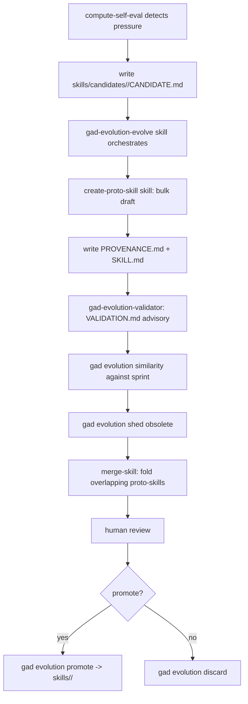

GAD's self-improvement loop. Pressure in a phase is a signal that some
repeatable pattern is missing from the skill set; the evolution loop
turns that signal into a distributable skill over three stages.

Stage 1 is automatic (compute-self-eval writes raw CANDIDATE.md). Stage 2
is agentic (the `create-proto-skill` skill drafts in bulk with per-
candidate checkpoints per decision gad-171, then `gad-evolution-validator`
writes VALIDATION.md advisorily). Stage 2b folds in housekeeping: run
`gad evolution similarity --against sprint` to surface candidates that
have gone obsolete against the current sprint window and bulk-remove
them with `gad evolution shed`, and run the `merge-skill` skill against
any remaining proto-skill pairs that cover the same ground. Stage 3 is
human — review and decide promote-or-discard. The loop gates on zero
pending proto-skills so humans stay in the approval path.

Proto-skill is a permanent type (decision gad-167): PROVENANCE.md
travels with the skill through promotion so we can triage by pressure
origin forever. Shed markers in `skills/.shed/` persist against
self-eval regeneration so obsolete candidates don't reappear.

