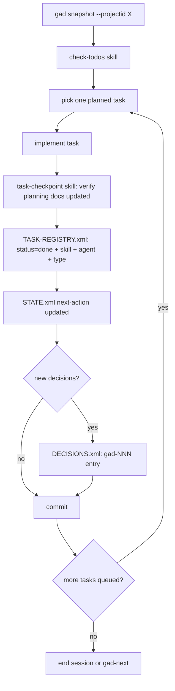

The canonical loop defined in CLAUDE.md and AGENTS.md: hydrate context
with `gad snapshot`, pick one `planned` task from TASK-REGISTRY.xml,
implement it, update the task's `status="done"` along with the mandatory
`skill` / `agent` / `type` attribution (decision gad-104), update
STATE.xml's next-action via `gad state set-next-action --projectid <id> "<text>"`
(hard cap 600 chars — pointer not journal), record any new decisions in
DECISIONS.xml using the `gad-NNN` format, and commit.

The attribution step is load-bearing. Without it the self-eval pipeline
has no data to compute `workflow_conformance` against (decision gad-173).
Skipping attribution is the single biggest source of trace gaps in the
measured reality (gad-162 baseline: 4 / 179 = 2.2% fully attributed).

**Operator-facing output during this loop follows the GAD communication
style** — see `references/communication-style.md`. SITREP tone, root set
once, tables for structured state, deltas only, no trailing summaries.
This is the default for every GAD project.

