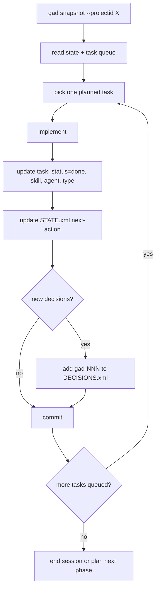

The canonical loop defined in CLAUDE.md and AGENTS.md: hydrate context
with `gad snapshot`, pick one `planned` task from TASK-REGISTRY.xml,
implement it, update the task's `status="done"` along with the mandatory
`skill` / `agent` / `type` attribution (decision gad-104), update
STATE.xml's next-action, record any new decisions in DECISIONS.xml using
the `gad-NNN` format, and commit.

The attribution step is load-bearing. Without it the self-eval pipeline
has no data to compute `framework_compliance` (and soon
`workflow_conformance`) against. Skipping attribution is the single
biggest source of trace gaps in the measured reality (gad-162
measurement: 4 / 179 = 2.2% fully attributed).

