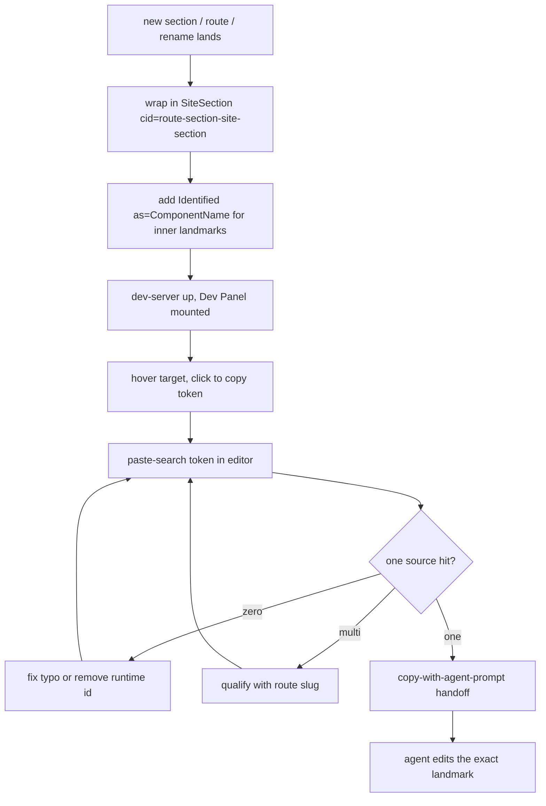

The Visual Context Panel is a dev-only overlay that lets the operator
hover a UI region, copy a stable source-search literal, and hand that
literal off to a coding agent as a landmark. It only works if the
landmark appears **verbatim in a source file** — no runtime-generated
ids, no template-literal concatenation, no `useId()`. Decision gad-187
locks `SiteSection cid="<route>-<section>-site-section"` as the
default section identity; `Identified as="<ComponentName>"` handles
inner landmarks more specific than the section shell.

This workflow is the development-time discipline that keeps the
invariant true as the UI grows. Every new section, every new route,
every component rename walks through it. The `gad-visual-context-system`
skill is the policy source of truth; this workflow is the expected
graph the trace pipeline matches against when mining `/planning`
Workflows tab.

The operator-facing loop is: (1) bring up the dev-server with the Dev
Panel mounted, (2) hover the target region in the browser, (3) click
the token to copy it, (4) paste-search the token in the editor and
confirm exactly one hit in source. Zero hits = typo or runtime id.
Multiple hits = ambiguity that needs a route-qualified literal. The
single-hit invariant is what the agent-prompt handoff rides on.

